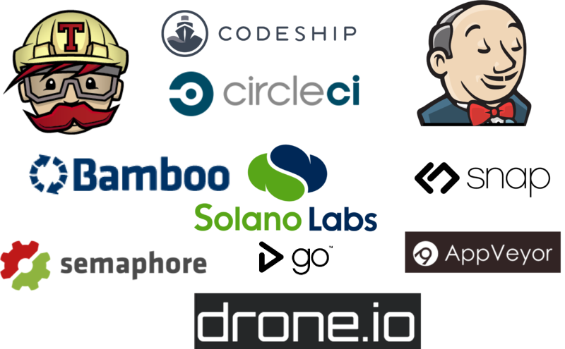
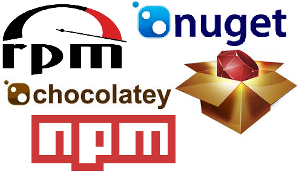
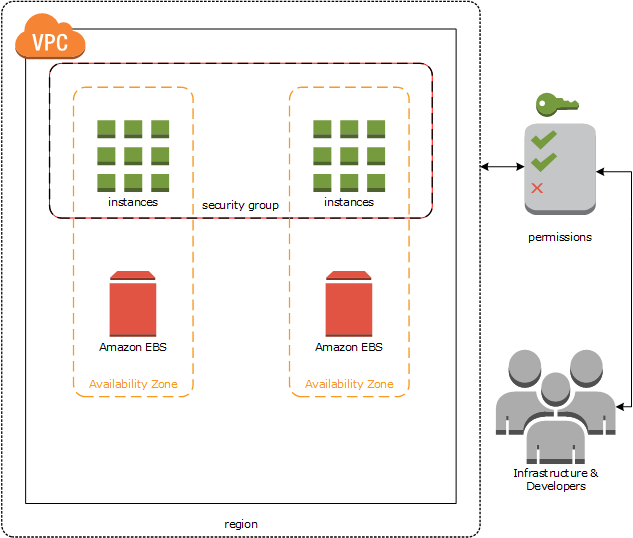
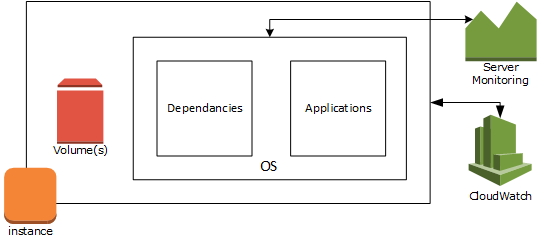
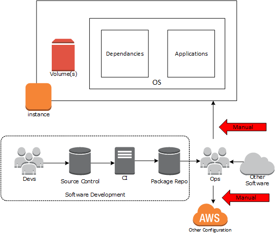
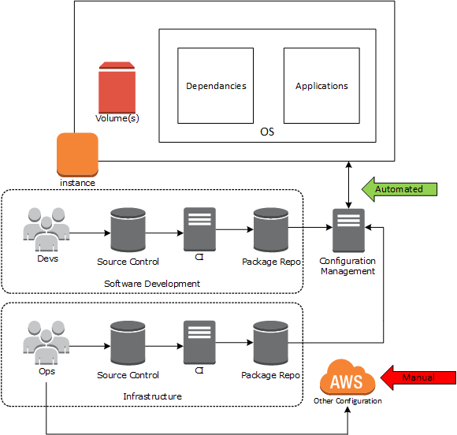
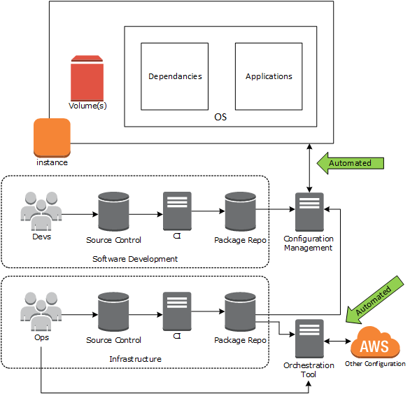

layout: true
class: middle

---

# Infrastructure Tooling

---

## What are these things and why do we need them?
* Source control
* Continuous integration
* Package repositories
* Configuration management
* Orchestration

---

# Benefits
* Save time through automation
* Reliable releases through the use and testing of that automation
* Frequent releases through quicker feedback

---

# Configuration Management
* Used to streamline the configuring and maintaining of servers
* Brings systems to a state that is defined via declarative description
* Allows machines to be configured in a way that is testable, versionable, and repeatable

---

.center[]

---

# Source Control (AKA Version Control)
* Systems that manage changes to documents (programs, web sites, other information)
* Different versions are associated with a unique identifier and the person making the change
* Allow for experimentation without breaking working code/configurations
* Enable comparison of different versions of the same document
* Known working and broken versions can be tagged as such

---

.center[]

---

# Continuous Integration
* More of a practice than a tool
* Typically involves a build server which automatically tests code/configuration (periodically or on check in)
* Good and bad versions of code/configuration can be identified quickly
* The good versions can then be automatically published to a package repo
* Proceed in the confidence you're building on a solid foundation

> "Continuous Integration doesn’t get rid of bugs, but it does make them dramatically easier to find and remove."
> - Martin Fowler

---

.center[]

---

# Package Repositories
* A storage location from which software packages can be retrieved and installed
* Typically works closely with a package manager, a tool which automatically downloads and installs a package and its dependencies on a machine
* Packages contain the software itself and some metadata:
  - Version number
  - Checksum
  - Dependencies

---

# Orchestration
TODO

---

.center[]

---

# How do these tools fit in?

---

.center[]

### .center[AWS]

---

### .center[An EC2 Instance]

.center[]

---

.center[]

### .center[Currently]

---

.center[]

### .center[With Configuration Management]

---

.center[]

### .center[With Orchestration]
